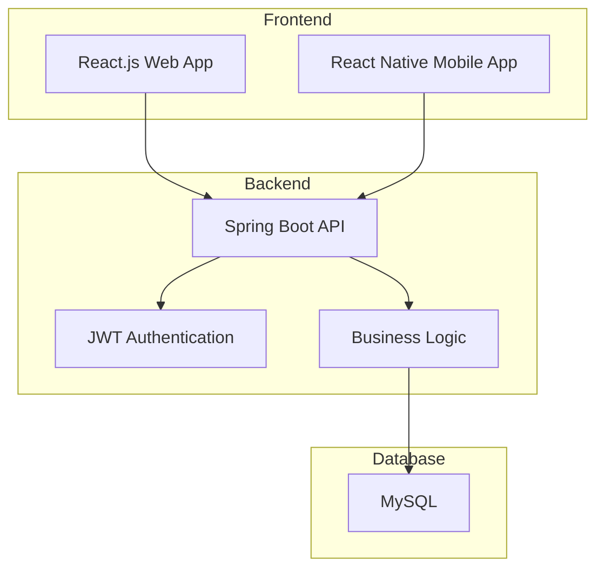

# Arquitectura de la Aplicación de Registro de Deudas de Joyería

## Visión General
Aplicación multi-plataforma para gestionar deudas de clientes en un negocio de joyería. Incluye versiones web y móvil nativa (Android/iOS), con backend reutilizable.

## Tecnologías Seleccionadas
- **Frontend Web**: React.js
- **Frontend Móvil**: React Native (nativo para Android e iOS)
- **Backend**: Java con Spring Boot
- **Base de Datos**: MySQL
- **Despliegue**: Heroku (backend), Vercel/Netlify (frontend web), Tiendas de apps (móvil)

## Arquitectura de Alto Nivel

## Modelo de Datos

### Entidades Principales
1. **Usuario**
   - ID, nombre, teléfono (único), rol (admin/cliente), contraseña (opcional inicialmente)
   - Admin: acceso completo, crea clientes
   - Cliente: acceso solo a sus datos, debe elegir contraseña al registrarse

2. **Cliente**
   - ID, nombre, teléfono, dirección
   - Vinculado a Usuario

3. **Deuda**
   - ID, cliente_id, monto_total, monto_restante, fecha_creación, estado (activa/liquidada)
   - Monto_restante se reduce con cada pago
   - Vinculada a Cliente

4. **Pago**
   - ID, deuda_id, monto, fecha, método_pago (efectivo/tarjeta)
   - Vinculada a Deuda, actualiza monto_restante

## Arquitectura Backend (Spring Boot)

### Capas
- **Controller**: Endpoints REST
- **Service**: Lógica de negocio
- **Repository**: Acceso a datos con JPA
- **Security**: JWT para autenticación, roles

### APIs Principales
- `POST /auth/login` - Autenticación
- `GET /deudas` - Listar deudas (filtrado por rol)
- `POST /deudas` - Crear deuda
- `PUT /deudas/{id}/pago` - Registrar pago
- `GET /reportes/mensuales` - Reportes mensuales

## Arquitectura Frontend

### Web (React.js)
- **Dashboard Admin**: Vista completa de clientes, deudas, estadísticas
- **Vista Cliente**: Acceso limitado a sus propias deudas
- Componentes: Tablas, formularios, gráficos (Chart.js)

### Móvil (React Native)
- Navegación: React Navigation
- Pantallas similares a web, optimizadas para móvil
- Notificaciones push: React Native Push Notification

## Funcionalidades Clave
1. **Registro de Clientes**: Admin crea clientes usando solo teléfono
2. **Autenticación por Roles**: Admin vs Cliente (cliente elige contraseña)
3. **Gestión de Deudas**: Crear, actualizar, ver progreso, reducir monto con pagos
4. **Registro de Pagos**: Semanales, con métodos de pago, actualiza deuda
5. **Historial Permanente**: Usuarios y datos permanecen tras liquidar deuda
6. **Notificaciones**: Recordatorios semanales
7. **Reportes**: Mensuales, estadísticas
8. **Dashboard**: Métricas de ventas y deudas

## Seguridad
- JWT para sesiones
- Encriptación de contraseñas
- Validación de inputs
- CORS configurado

## Despliegue
- **Backend**: Heroku (plan gratuito inicial)
- **Frontend Web**: Vercel/Netlify
- **Móvil**: Publicación en Google Play/App Store

## Próximos Pasos
Esta arquitectura proporciona una base sólida. El siguiente paso es implementar el backend comenzando por el modelo de datos y las APIs básicas.